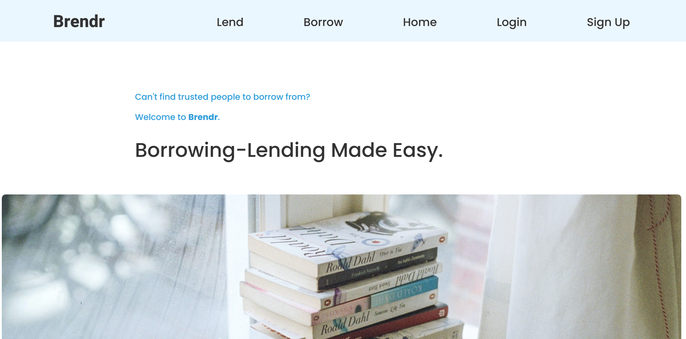
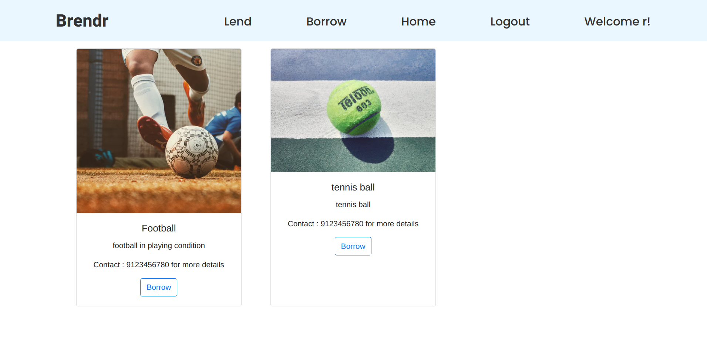
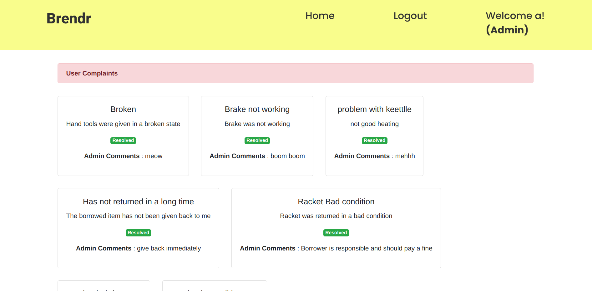
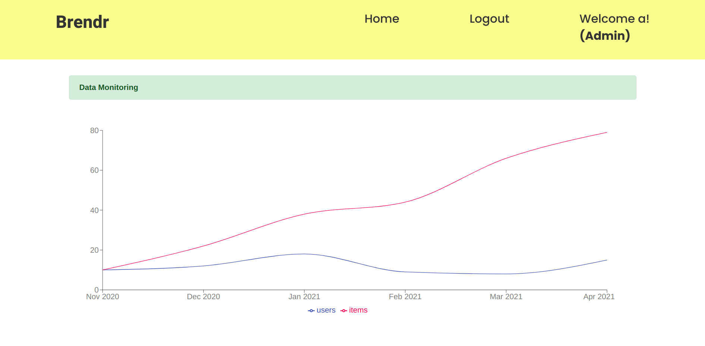

# Brendr

A platform for efficient borrowing-lending in close-knit communities.

## Description
Brendr is implemented as a MERN stack web-app that provides a platform for free borrowing-lending between people in close-knit communities like college campuses.

## Screenshots

## Authors

- Mir Ameen
- Sarthak Sheoran
- Rupanshu Soi
- Nipun Wahi
- Hasnain Zeenwala

Department of Computer Science, BITS Pilani - Hyderabad Campus, India
